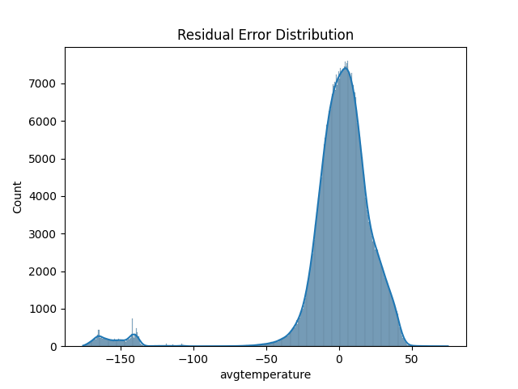

🌆 Urban Heat Island (UHI) Prediction
Hybrid PSO + CSA Optimized Deep Learning Model
📌 Project Overview

Urban Heat Island (UHI) effect refers to the phenomenon where urban regions experience significantly higher temperatures than their surrounding rural areas due to dense infrastructure, reduced vegetation, and human activities.

This project implements a Hybrid Particle Swarm Optimization (PSO) + Cuckoo Search Algorithm (CSA) optimized Deep Neural Network to predict urban temperature patterns, enabling data-driven insights for climate-resilient city planning.

🎯 Objectives

Predict urban temperature using historical city climate data

Optimize neural network architecture using PSO + CSA hybrid optimization

Handle large-scale datasets safely without memory overflow

Generate interpretable outputs: metrics, graphs, CSV, JSON, and configs

Provide a reproducible and extensible ML pipeline

🧠 Model Architecture
🔹 Hybrid Optimization Strategy
PSO (Global Search)
        ↓
CSA (Local Refinement)
        ↓
Optimized Neural Network

🔹 Final Prediction Model

Fully Connected Deep Neural Network (DNN)

Optimized number of neurons via PSO + CSA

Trained for 20 epochs (efficient & stable)

📊 Dataset Used

City Temperature Dataset

city_temperature.csv

Selected Features
Feature	Description
AvgTemperature	Target variable (Urban temperature)
Year	Temporal feature
Month	Temporal feature
Day	Temporal feature
⚠️ Data Handling

Chunk-based CSV loading (memory safe)

Forced numeric dtypes

Invalid temperature filtering

Early downsampling for performance

🧪 Technologies & Libraries

Python 3.9+

TensorFlow / Keras

Scikit-learn

Pandas, NumPy

Matplotlib, Seaborn

Joblib, YAML, JSON

📁 Project Structure
Urban Heat Island (UHI) Prediction/
│
├── archive/
│   └── city_temperature.csv
│
├── graphs/
│   ├── psa_accuracy.png
│   ├── psa_rmse.png
│   ├── psa_actual_vs_predicted.png
│   └── psa_heatmap.png
│
├── psa_uhi_model.h5
├── psa_uhi_scaler.pkl
├── psa_uhi_results.csv
├── psa_uhi_predictions.json
├── psa_uhi_config.yaml
└── README.md

📦 Output Files Explained
🔹 Model & Preprocessing

psa_uhi_model.h5 → Trained hybrid neural network

psa_uhi_scaler.pkl → StandardScaler for feature normalization

🔹 Results & Metrics

psa_uhi_results.csv → Actual vs Predicted values

psa_uhi_predictions.json → RMSE, R² score, hyperparameters

psa_uhi_config.yaml → Model configuration metadata

🔹 Visualizations

Accuracy (R²) comparison

RMSE performance

Actual vs Predicted trends

Feature correlation heatmap

📈 Evaluation Metrics
Metric	Description
RMSE	Measures prediction error magnitude
R² Score	Explains variance captured by the model
▶️ How to Run
1️⃣ Install Dependencies
pip install tensorflow scikit-learn pandas numpy matplotlib seaborn pyyaml joblib

2️⃣ Set Dataset Path

Ensure the dataset exists at:

C:\Users\NXTWAVE\Downloads\Urban Heat Island (UHI) Prediction\archive\city_temperature.csv

3️⃣ Run the Script
python hybrid_pso_csa_uhi.py

⚠️ Important: Restart the Python kernel before execution to avoid memory fragmentation.

🧠 Why Hybrid PSO + CSA?
Algorithm	Strength
PSO	Fast global exploration
CSA	Efficient local exploitation
Hybrid	Better convergence, fewer epochs

This hybrid approach avoids manual tuning and improves generalization.

🌍 Use Cases

Climate-resilient urban planning

Smart city temperature forecasting

Urban sustainability studies

Environmental impact assessment

Academic research (UG / PG / PhD)

🚀 Future Enhancements

CNN-based spatial UHI mapping

NDVI + LST satellite data fusion

GeoTIFF output for GIS tools

Digital Twin integration

Real-time IoT temperature feeds

Web dashboard (Streamlit / Dash)

📚 Research & Academic Relevance

Suitable for IEEE / Springer / Elsevier publications

Demonstrates hybrid metaheuristic optimization

Scalable for real-world climate datasets

🧑‍💻 Author Notes

This project is designed with robust data engineering practices, ensuring:

No memory overflow on large datasets

Clean separation of optimization & learning

Reproducible results with saved artifacts
